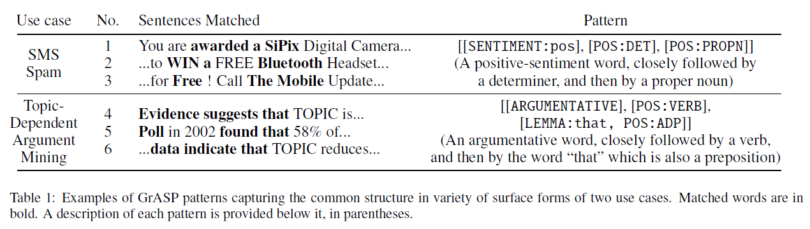

# GrASP

    

**GrASP** (GReedy Augmented Sequential Patterns) is an algorithm for extracting patterns from text data ([Shnarch et. al., 2017](https://www.aclweb.org/anthology/D17-1140.pdf)). Basically, it takes as input a list of positive and negative examples of a target phenomenon and outputs a ranked list of patterns that distinguish between the positive and the negative examples. For instance, two GrASP patterns from two use cases are shown in the Table below along with the sentences they match.



This repository provides the implementation of GrASP, a web-based tool for exploring the results from GrASP, and two example notebooks for use cases of GrASP. This project is a joint collaboration between Imperial College London and IBM Research.

**Paper**: [GrASP: A Library for Extracting and Exploring Human-Interpretable Textual Patterns](http://www.lrec-conf.org/proceedings/lrec2022/pdf/2022.lrec-1.655.pdf)

**Authors**: [Piyawat Lertvittayakumjorn](https://plkumjorn.github.io/), [Leshem Choshen](https://ktilana.wixsite.com/leshem-choshen), [Eyal Shnarch](https://researcher.watson.ibm.com/researcher/view.php?person=il-EYALS), and [Francesca Toni](https://www.doc.ic.ac.uk/~ft/). 

**Contact**: Piyawat Lertvittayakumjorn (plkumjorn [at] gmail [dot] com)


## Installation

This library can be installed via pip under the name `grasptext`.

```
pip install grasptext
```

Otherwise, you may use the stand-alone version of our library (no longer maintained) by switching to the `standalone` branch of this repository and following the README instructions there.   

## Usage

```python    
import grasptext
# Step 1: Create the GrASP model
grasp_model = grasptext.GrASP(num_patterns = 200, 
                    gaps_allowed = 2, 
                    alphabet_size = 200, 
                    include_standard = ['TEXT', 'POS', 'NER', 'SENTIMENT'])
# Step 2: Fit it to the training data
the_patterns = grasp_model.fit_transform(pos_exs, neg_exs)
# Step 3: Export the results 
grasp_model.to_csv('results.csv')
grasp_model.to_json('results.json')
```

As shown above, GrASP can be used in three steps:
1. Creating a GrASP model (with hyperparameters specified)
2. Fit the GrASP model to the lists of positive and negative examples
3. Export the results to a csv or a json file

### Hyperparameters for GrASP (Step 1)
- `min_freq_threshold` (float, default = 0.005) -- Attributes which appear less often than this proportion of the number of training examples will be discarded as they are non-frequent.
- `correlation_threshold` (float, default = 0.5) -- Attributes/patterns whose correlation to some previously selected attribute/pattern is above this threshold, measured by the normalized mutual information, will be discarded.
- `alphabet_size` (int, default = 100) -- The alphabet size.
- `num_patterns` (int, default = 100) -- The number of output patterns.
- `max_len` (int, default = 5) -- The maximum number of attributes per pattern.
- `window_size` (Optional[int], default = 10) -- The window size for the output patterns.
- `gaps_allowed` (Optional[int], default = None) -- If gaps allowed is not None, it overrules the window size and specifies the number of gaps allowed in each output pattern.
- `gain_criteria` (str or Callable[[Pattern], float]], default = 'global') -- The criterion for selecting alphabet and patterns. 'global' refers to the information gain criterion. The current version also supports a criterion of `F_x` (such as `F_0.01`). 
- `min_coverage_threshold` (Optional[float], default = None) -- The minimum proportion of examples matched for output patterns (so GrASP does not generate too specific patterns).
- `print_examples` (Union[int, Sequence[int]], default = 2) -- The number of examples and counter-examples to print when printing a pattern. If `print_examples` equals `(x, y)`, it prints `x` examples and `y` counter-examples for each pattern. If `print_examples` equals `x`, it is equivalent to `(x, x)`.
- `include_standard` (List[str], default = ['TEXT', 'POS', 'NER', 'HYPERNYM', 'SENTIMENT']) -- The built-in attributes to use. Available options are ['TEXT', 'LEMMA', 'POS', 'DEP', 'NER', 'HYPERNYM', 'SENTIMENT'].
- `include_custom` (List[CustomAttribute], default = []) -- The list of custom attributes to use.

### Built-in attributes
The current implementation of GrASP consists of seven standard attributes. The full lists of tags for POS, DEP, and NER can be found from [SPACY](https://github.com/explosion/spaCy/blob/master/spacy/glossary.py).

1. **TEXT attribute** of a token is the token in lower case.
2. **LEMMA attribute** of a token is its lemma obtained from SPACY.
3. **POS attribute** of a token is the part-of-speech tag of the token according to [the universal POS tags](https://universaldependencies.org/u/pos/)
4. **DEP attribute** of a token is the dependency parsing tag of the token (the type of syntactic relation that connects the child to the head)
5. **NER attribute** is a token (if any) is the named entity type of the token.
6. **HYPERNYM attribute** of a/an (noun, verb, adjective, adverb) token is the synsets of the hypernyms of the token (including the synset of the token itself). The hypernym hierarchy is based on [WordNet (nltk)](https://www.nltk.org/howto/wordnet.html). Note that we consider only **three levels of synsets** above the token of interest in order to exclude synsets that are too abstract to comprehend (e.g., psychological feature, group action, and entity).
7. **SENTIMENT attribute** of a token (if any) indicates the sentiment (pos or neg) of the token based on the lexicon in [Minqing Hu and Bing Liu. 2004. Mining and summarizing customer reviews. In International Conference on Knowledge Discovery and Data Mining, KDD’04, pages 168–177.](https://www.cs.uic.edu/~liub/FBS/sentiment-analysis.html#lexicon)

### Examples of augmented texts

Input sentence: London is the capital and largest city of England and the United Kingdom.

```
London: {'SPACY:NER-GPE', 'SPACY:POS-PROPN', 'TEXT:london', 'HYPERNYM:london.n.01'}
is: {'SPACY:POS-VERB', 'TEXT:is', 'HYPERNYM:be.v.01'}
the: {'TEXT:the', 'SPACY:POS-DET'}
capital: {'SPACY:POS-NOUN', 'HYPERNYM:capital.n.06', 'TEXT:capital'}
and: {'TEXT:and', 'SPACY:POS-CCONJ'}
largest: {'HYPERNYM:large.a.01', 'TEXT:largest', 'SPACY:POS-ADJ'}
city: {'HYPERNYM:urban_area.n.01', 'HYPERNYM:municipality.n.01', 'TEXT:city', 'SPACY:POS-NOUN', 'HYPERNYM:geographical_area.n.01', 'HYPERNYM:administrative_district.n.01', 'HYPERNYM:district.n.01', 'HYPERNYM:city.n.01'}
of: {'SPACY:POS-ADP', 'TEXT:of'}
England: {'SPACY:NER-GPE', 'HYPERNYM:england.n.01', 'SPACY:POS-PROPN', 'TEXT:england'}
and: {'TEXT:and', 'SPACY:POS-CCONJ'}
the: {'TEXT:the', 'SPACY:POS-DET', 'SPACY:NER-GPE'}
United: {'TEXT:united', 'SPACY:NER-GPE', 'SPACY:POS-PROPN'}
Kingdom: {'HYPERNYM:kingdom.n.05', 'SPACY:POS-PROPN', 'HYPERNYM:taxonomic_group.n.01', 'TEXT:kingdom', 'SPACY:NER-GPE', 'HYPERNYM:biological_group.n.01', 'HYPERNYM:group.n.01'}
.: {'TEXT:.', 'SPACY:POS-PUNCT'}
```

Input sentence: This was the worst restaurant I have ever had the misfortune of eating at.

```
This: {'SPACY:POS-DET', 'TEXT:this'}
was: {'TEXT:was', 'SPACY:POS-VERB', 'HYPERNYM:be.v.01'}
the: {'TEXT:the', 'SPACY:POS-DET'}
worst: {'SENTIMENT:neg', 'HYPERNYM:worst.a.01', 'SPACY:POS-ADJ', 'TEXT:worst'}
restaurant: {'SPACY:POS-NOUN', 'HYPERNYM:artifact.n.01', 'HYPERNYM:restaurant.n.01', 'HYPERNYM:building.n.01', 'TEXT:restaurant', 'HYPERNYM:structure.n.01'}
I: {'TEXT:i', 'SPACY:POS-PRON'}
have: {'SPACY:POS-VERB', 'TEXT:have', 'HYPERNYM:own.v.01'}
ever: {'SPACY:POS-ADV', 'TEXT:ever', 'HYPERNYM:always.r.01'}
had: {'SPACY:POS-VERB', 'TEXT:had', 'HYPERNYM:own.v.01'}
the: {'TEXT:the', 'SPACY:POS-DET'}
misfortune: {'TEXT:misfortune', 'HYPERNYM:fortune.n.04', 'HYPERNYM:state.n.02', 'SPACY:POS-NOUN', 'SENTIMENT:neg', 'HYPERNYM:misfortune.n.02', 'HYPERNYM:condition.n.03'}
of: {'SPACY:POS-ADP', 'TEXT:of'}
eating: {'SPACY:POS-VERB', 'HYPERNYM:change.v.01', 'HYPERNYM:damage.v.01', 'TEXT:eating', 'HYPERNYM:corrode.v.01'}
at: {'SPACY:POS-ADP', 'TEXT:at'}
.: {'TEXT:.', 'SPACY:POS-PUNCT'}
```
### Supporting features

- **Translating from a pattern to its English explanation**

```python
# Continue from the code snippet above
print(grasptext.pattern2text(the_patterns[0]))
```
- **Removing redundant patterns**
    - Mode = 1: Remove pattern p2 if there exists p1 in the patterns set such that p2 is a specialization of p1 and metric of p2 is lower than p1
    - Mode = 2: Remove pattern p2 if there exists p1 in the patterns set such that p2 is a specialization of p1 regardless of the metric value of p1 and p2

```python
selected_patterns = grasptext.remove_specialized_patterns(the_patterns, metric = lambda x: x.precision, mode = 1)
```
- **Vectorizing texts using patterns**

```python
X_array = grasptext.extract_features(texts = pos_exs + neg_exs,
                 patterns = selected_patterns,
                 include_standard = ['TEXT', 'POS', 'NER', 'SENTIMENT'])
```

- **Creating a custom attribute**

In order to create a custom attribute, you are required to implement two functions.
1. An extraction function extracts attributes for a given input text.
    - **Input**: An input text (`text`) and a list of tokens in this input text (`tokens`). (You may use either or both of them in your extraction function.)
    - **Output**: A list of sets where the set at index `i` contains attributes extracted for the input token `i`.  
2. A translation function tells our library how to read this custom attribute in patterns.
    - **Input**: An attribute to read (`attr`) in the form ATTRIBUTE_NAME:ATTRIBUTE (e.g., SENTIMENT:pos) and a boolean `is_complement` specifying whether we want the returned attribute description as an adjective phrase or as a noun.
    - **Output**: The natural language read (i.e., description) of the attribute. For instance, given an attribute SENTIMENT:pos, the output could be 'bearing a positive sentiment' or 'a positive-sentiment word' depending on whether `is_complement` equals True or False.

After you obtain both functions, put them as parameters of `grasptext.CustomAttribute` together with the attribute name to create the custom attribute and use it in the GrASP engine via the `include_custom` hyperparameter.

An example demonstrating how to create and use a custom attribute is shown below.

```python
ARGUMENTATIVE_LEXICON = [line.strip().lower() for line in open('data/argumentative_unigrams_lexicon_shortlist.txt', 'r') if line.strip() != '']
def _argumentative_extraction(text: str, tokens: List[str]) -> List[Set[str]]:
    tokens = map(str.lower, tokens)
    ans = []
    for t in tokens:
        t_ans = []
        if t.lower() in ARGUMENTATIVE_LEXICON:
            t_ans.append('Yes')
        ans.append(set(t_ans))
    return ans

def _argumentative_translation(attr:str, 
                      is_complement:bool = False) -> str:
    word = attr.split(':')[1]
    assert word == 'Yes'
    return 'an argumentative word'

ArgumentativeAttribute = grasptext.CustomAttribute(name = 'ARGUMENTATIVE', 
    extraction_function = _argumentative_extraction, 
    translation_function = _argumentative_translation)

grasp_model = grasptext.GrASP(include_standard = ['TEXT', 'POS', 'NER', 'SENTIMENT'],
                          include_custom = [ArgumentativeAttribute]
                         )
```

### Data structure of the JSON result file
If you want to use our web exploration tool to display results from other pattern extraction algorithms, you may do so by organizing the results into a JSON file with the structure required by our web exploration tool (i.e., the same structure as produced by `grasptext`). Note that you don't need to fill in the fields that are not applicable to your pattern extraction algorithm.

```javascript
{
    "configuration": {                                          // A dictionary of hyperparameters of the pattern extraction algorithm 
        "min_freq_threshold": 0.005, 
        "correlation_threshold": 0.5,
        "alphabet_size": 200, 
        "num_patterns": 200, 
        "max_len": 5, 
        "window_size": null, 
        "gaps_allowed": 0, 
        "gain_criteria": "global", 
        "min_coverage_threshold": null, 
        "include_standard": ["TEXT", "POS", "NER", "HYPERNYM"], 
        "include_custom": [],                                   // A list of names of custom attributes
        "comment": ""                                           // An additional comment
    }, 
    "alphabet": [                                               // A list of alphabet (all the unique attributes)
        "HYPERNYM:jesus.n.01", 
        "HYPERNYM:christian.n.01", 
        "TEXT:christ", 
        ...
    ],
    "rules": [                                                  // A list of dictionaries each of which contains information of a specific pattern (i.e., rule)
        {
          "index": 0,                                           // Pattern index
          "pattern": "[['HYPERNYM:jesus.n.01']]",               // The pattern
          "meaning": "A type of jesus (n)",                     // The translation
          "class": "pos",                                       // The associated class
          "#pos": 199,                                          // The number of positive examples matched (in the training set)
          "#neg": 34,                                           // The number of negative examples matched (in the training set)
          "score": 0.10736560419589636,                         // The metric score (on the training set)
          "coverage": 0.26998841251448435,                      // Coverage (on the training set)    
          "precision": 0.8540772532188842,                      // Precision (on the training set)
          "recall": 0.4171907756813417,                         // Recall (on the training set)
          "F1": 0.5605633802816902,                             // F1 (on the training set)
          "pos_example_labels": [false, false, false, ...],     // A list showing whether each positive example is matched by this pattern
          "neg_example_labels": [false, false, false, ...]      // A list showing whether each negative example is matched by this pattern
        },
        { 
          "index": 1,
          "pattern": "[['HYPERNYM:christian.n.01']]",
          "meaning": "A type of christian (n)",
          ...
        },
        ...
     ],
     "dataset":{
        "info": {"total": 863, "#pos": 477, "#neg": 386},       // Information about the training set (Number of all examples, positive examples, and negative examples, respectively
        "pos_exs": [                                            // A list of positive examples in the training set
            {
                "idx": 0,                                       // Positive example index
                "text": "Hi,\n\tDoes anyone ...",               // The full text
                "tokens": ["Hi", ",", "\n\t", "Does"],          // The tokenized text
                "label": "pos",                                 // The label in the training set 
                "rules": [[], [], [], [], [165, 171], [], ...], // A list where element i shows indices of rules matching token i of this text 
                "class": [[], [], [], [], [1, 1], [], ...]      // A list where element i shows the associated classes (0 or 1) of rules matching token i of this text
            },
            {
                "idx": 1,
                "text": "jemurray@magnus.acs.ohio-state.edu ...",
                "tokens": ["jemurray@magnus.acs.ohio-state.edu", "(", "John", ...],
                ...
            },
            ...              
        ],
        "neg_exs": [                                            // A list of negative examples in the training set
            {
                "idx": 0,
                "text": "Tony Lezard <tony@mantis.co.uk> writes: ...",
                "tokens": ["Tony", "Lezard", "<", "tony@mantis.co.uk", ">", "writes", ...],
                ...
            },
            ...
        ]
     }
}
```

## The Web Exploration Tool

**Requirements**: [Python 3.6](https://www.python.org/downloads/release/python-360/) and [Flask](https://flask.palletsprojects.com/)

**Steps**
1. To import json result files to the web system, please edit `web_demo/settings.py`. For instance,

```python
CASES = {
    1: {'name': 'SMS Spam Classification', 'result_path': '../examples/results/case_study_1.json'},
    2: {'name': 'Topic-dependent Argument Mining', 'result_path': '../examples/results/case_study_2.json'},
}
```

2. To run the web system, go inside the web_demo folder and run `python -u app.py`. You will see the following messages.

```
$ python -u app.py
 * Restarting with stat
 * Debugger is active!
 * Debugger PIN: 553-838-653
 * Running on http://127.0.0.1:5000/ (Press CTRL+C to quit)

```

So, using your web browser, you can access all the reports at http://127.0.0.1:5000/.

Note that we have the live demo of our two case studies (spam detection and argument mining) now running [here](https://plkumjorn.pythonanywhere.com/). 

## Repository Structure

    .
    ├── examples/
    │    ├── data/          # For downloaded data
    │    ├── results/       # For exported results (.json, .csv)
    │    ├── CaseStudy1_SMSSpamCollection.ipynb
    │    └── CaseStudy2_ArgumentMining.ipynb
    ├── figs/               # For figures used in this README file
    ├── grasptext/          # Main Python package directory
    |    └── grasptext.py   # The main grasptext code
    ├── web_demo/           # The web-based exploration tool
    │    ├── static/        # For CSS and JS files
    │    ├── templates/     # For Jinja2 templates for rendering the html output 
    │    ├── app.py         # The main Flask application
    │    └── settings.py    # For specifying locations of JSON result files to explore   
    ├── .gitignore
    ├── LICENSE
    ├── MANIFEST.in
    ├── README.md
    ├── index.html          # For redirecting to our demo website
    └── setup.py            # For building Python package and pushing to PyPi   

## Citation

If you use or refer to the implementation in this repository, please cite the following paper.

    @InProceedings{lertvittayakumjorn-EtAl:2022:LREC,
        author    = {Lertvittayakumjorn, Piyawat  and  Choshen, Leshem  and  Shnarch, Eyal  and  Toni, Francesca},
        title     = {GrASP: A Library for Extracting and Exploring Human-Interpretable Textual Patterns},
        booktitle      = {Proceedings of the Language Resources and Evaluation Conference},
        month          = {June},
        year           = {2022},
        address        = {Marseille, France},
        publisher      = {European Language Resources Association},
        pages     = {6093--6103},
        url       = {https://aclanthology.org/2022.lrec-1.655}
    }


If you refer to [the original GrASP algorithm](https://www.aclweb.org/anthology/D17-1140.pdf), please cite the following paper.

    @inproceedings{shnarch-etal-2017-grasp,
        title = "{GRASP}: Rich Patterns for Argumentation Mining",
        author = "Shnarch, Eyal  and
          Levy, Ran  and
          Raykar, Vikas  and
          Slonim, Noam",
        booktitle = "Proceedings of the 2017 Conference on Empirical Methods in Natural Language Processing",
        month = sep,
        year = "2017",
        address = "Copenhagen, Denmark",
        publisher = "Association for Computational Linguistics",
        url = "https://www.aclweb.org/anthology/D17-1140",
        doi = "10.18653/v1/D17-1140",
        pages = "1345--1350",
    }


## Contact
Piyawat Lertvittayakumjorn (plkumjorn [at] gmail [dot] com)
